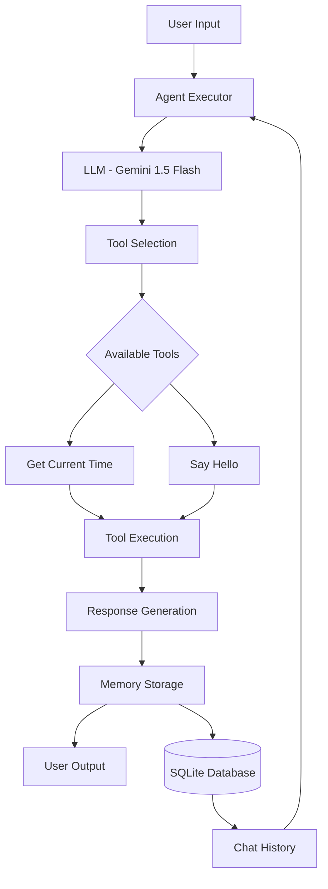

# 🏗️ Arsitektur & Alur Kerja Agent

## Arsitektur Sistem



## Komponen Utama

### 1. **LLM Engine**
- **Model**: Google Gemini 1.5 Flash
- **Temperature**: 0.2 (konsisten, tidak terlalu kreatif)
- **API**: Google AI Studio API

```python
llm = ChatGoogleGenerativeAI(
    model="gemini-1.5-flash", 
    temperature=0.2
)
```

### 2. **Agent Executor**
- **Type**: Conversational ReAct Description
- **Framework**: LangChain Agents
- **Verbose**: True (untuk debugging)

```python
agent = initialize_agent(
    tools=TOOLS,
    llm=llm,
    agent=AgentType.CONVERSATIONAL_REACT_DESCRIPTION,
    memory=memory,
    verbose=True
)
```

### 3. **Tools System**
Available tools:
- `get_current_time`: Mendapatkan waktu saat ini
- `say_hello`: Menyapa user dengan nama

### 4. **Memory System**
- **Storage**: SQLite Database
- **Type**: Episodic Memory
- **Persistence**: Cross-session memory

### 5. **Environment Management**
- **Configuration**: `.env` file
- **Security**: API key management
- **Dependencies**: `requirements.txt`

## Alur Kerja Detail

### Step-by-Step Process:

1. **Input Reception**
   ```python
   user_input = input("\nYou: ")
   ```

2. **Memory Loading**
   - Load chat history dari SQLite
   - Inject ke conversation context

3. **LLM Processing**
   - Analisis input user
   - Determine action needed
   - Select appropriate tool (jika diperlukan)

4. **Tool Execution**
   ```python
   # Contoh tool execution
   def _get_current_time(input: str = "") -> str:
       return datetime.now().strftime("%Y-%m-%d %H:%M:%S")
   ```

5. **Response Generation**
   - Combine tool results dengan natural language
   - Generate contextual response

6. **Memory Storage**
   ```python
   # Auto-save ke SQLite
   history = SQLChatMessageHistory(
       session_id="default", 
       connection="sqlite:///memory.db"
   )
   ```

7. **Output Display**
   ```python
   response = agent.invoke({"input": user_input})
   print(f"Agent: {response['output']}")
   ```

## Data Flow Diagram

```
User Input → Agent → Memory Retrieval → LLM Analysis → Tool Selection → Execution → Response → Memory Storage → Output
     ↑                                                                                              ↓
     ←←←←←←←←←←←←←←←←←←←←←←←←←←←←←←←←←←←←←← Feedback Loop ←←←←←←←←←←←←←←←←←←←←←←←←←←←←←←←←←←←←←←←←←←←←←←←←
```

## Keunggulan Arsitektur

### ✅ **Modular Design**
- Tools dapat ditambah/dihapus dengan mudah
- Memory system terpisah dan configurable
- LLM engine dapat diganti tanpa mengubah core logic

### ✅ **Persistent Memory**  
- SQLite database untuk long-term storage
- Session-based conversation tracking
- Cross-restart memory retention

### ✅ **Error Resilience**
- Comprehensive error handling
- Graceful degradation
- User-friendly error messages

### ✅ **Scalable**
- Easy to add new tools
- Configurable memory backends
- Multiple LLM support potential

## Limitasi Arsitektur

### ❌ **Single User**
- Saat ini hanya support satu user session
- Tidak ada user authentication

### ❌ **Limited Tools**
- Hanya 2 tools basic
- Tidak ada web search atau advanced capabilities

### ❌ **No RAG**
- Tidak ada knowledge base integration
- Tidak ada document retrieval system

## Future Architecture Improvements

### 🔮 **Planned Enhancements**
1. **Multi-user Support**: User session management
2. **RAG Integration**: Vector database + document retrieval
3. **API Gateway**: REST API endpoints
4. **Tool Marketplace**: Plugin system untuk tools
5. **Advanced Memory**: Semantic + episodic hybrid

## File Structure

```
personal-agent-simple/
├── agent.py              # Main agent loop
├── tools.py              # Tool definitions
├── memory.py             # (Reserved for future use)
├── requirements.txt      # Dependencies
├── .env                  # Environment variables
├── .env.example         # Environment template
├── .gitignore           # Git ignore rules
├── memory.db            # SQLite database (auto-generated)
└── docs/                # Documentation
    ├── README.md        # Main documentation
    ├── architecture.md  # This file
    ├── memory-approach.md
    ├── strategy.md
    ├── results-reflection.md
    └── setup.md
```

## Technical Stack

- **Python**: 3.13+
- **LangChain**: 0.3.26
- **Google Gemini**: 1.5 Flash model
- **SQLite**: Database untuk persistent memory
- **python-dotenv**: Environment variable management

---

**Next**: [🧠 Pendekatan Memory](memory-approach.md)
