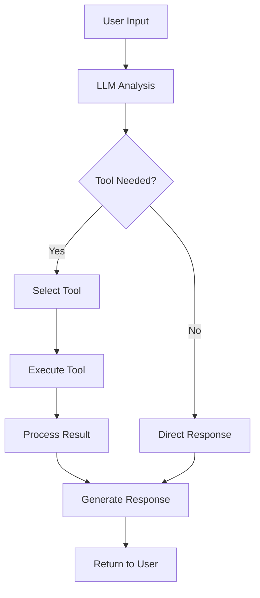

# 🎯 RAG / Prompt Strategy & Implementation

## Strategy Overview: Tool-based Agent (Non-RAG)

Agent ini menggunakan **Tool-based Approach** dengan **ReAct Pattern**, **bukan RAG (Retrieval Augmented Generation)**.

## Mengapa Bukan RAG?

### RAG Requirements yang Tidak Ada:
- ❌ **External Knowledge Base**: Tidak ada document collection
- ❌ **Vector Embeddings**: Tidak menggunakan embedding models
- ❌ **Document Retrieval**: Tidak ada document search system
- ❌ **Knowledge Augmentation**: Tidak ada external knowledge injection

### Tool-based Approach Instead:
- ✅ **Function Calling**: Tools sebagai external capabilities
- ✅ **Structured Actions**: Predefined actions yang dapat dilakukan
- ✅ **Deterministic Results**: Tool outputs yang predictable

## ReAct Pattern Implementation

### ReAct = Reasoning + Acting

```python
agent = initialize_agent(
    tools=TOOLS,
    llm=llm,
    agent=AgentType.CONVERSATIONAL_REACT_DESCRIPTION,
    memory=memory,
    verbose=True
)
```

### ReAct Process Flow:

1. **Reasoning**: Analyze user input dan determine action
2. **Acting**: Execute appropriate tool
3. **Observing**: Process tool results  
4. **Response**: Generate natural language response

### Example ReAct Execution:

```
User: "what time is it?"

> Entering new AgentExecutor chain...
Thought: The user is asking for the current time.
Action: get_current_time
Action Input: ""
Observation: 2025-07-01 14:30:25
Thought: I now have the current time information.
Final Answer: The current time is 2025-07-01 14:30:25.
```

## Tool Strategy

### Tool Design Philosophy:

#### 1. **Simple & Focused**
Setiap tool memiliki single responsibility:

```python
def _get_current_time(input: str = "") -> str:
    """Returns the current time as a string."""
    return datetime.now().strftime("%Y-%m-%d %H:%M:%S")
```

#### 2. **Clear Descriptions**
Tool descriptions yang jelas untuk LLM understanding:

```python
get_current_time_tool = Tool(
    name="get_current_time",
    description="Returns the current date and time. No input required.",
    func=_get_current_time
)
```

#### 3. **Error Handling**
Tools dengan proper error handling:

```python
def _safe_tool_execution(func):
    try:
        return func()
    except Exception as e:
        return f"Error executing tool: {str(e)}"
```

### Current Tool Portfolio:

#### 1. **Time Tool**
```python
# Purpose: Provide current timestamp
# Use cases: Time queries, scheduling context
# Input: None required
# Output: Formatted datetime string

get_current_time_tool = Tool(
    name="get_current_time",
    description="Returns the current date and time. No input required.",
    func=_get_current_time
)
```

#### 2. **Greeting Tool** 
```python
# Purpose: Personalized greetings
# Use cases: Hello messages, name-based responses
# Input: User name
# Output: Personalized greeting message

say_hello_tool = Tool(
    name="say_hello",
    description="Greets the user by name. Input should be the user's name.",
    func=_say_hello
)
```

### Tool Execution Flow:



## Prompt Engineering Strategy

### 1. **Conversational Context**

Agent mempertahankan conversational context melalui memory:

```python
memory = ConversationBufferMemory(
    chat_memory=history,
    memory_key="chat_history", 
    return_messages=True
)
```

### 2. **Tool Selection Prompting**

LLM menggunakan tool descriptions untuk decision making:

```
Available tools:
- get_current_time: Returns the current date and time. No input required.
- say_hello: Greets the user by name. Input should be the user's name.
```

### 3. **Response Synthesis**

Agent menggabungkan tool results dengan natural language:

```python
# Tool result: "2025-07-01 14:30:25"
# Agent response: "The current time is July 1st, 2025 at 2:30 PM."
```

## Agent Behavior Configuration

### Temperature Setting:
```python
llm = ChatGoogleGenerativeAI(
    model="gemini-1.5-flash", 
    temperature=0.2  # Low temperature untuk consistency
)
```

**Rationale**: 
- Low temperature (0.2) untuk consistent tool selection
- Reduces random behavior dalam tool calling
- Maintains predictable responses

### Verbose Mode:
```python
agent = initialize_agent(
    # ... other params
    verbose=True  # Shows reasoning process
)
```

**Benefits**:
- Debugging visibility
- Understanding decision process
- Monitoring tool usage

## Conversation Flow Strategy

### 1. **Input Processing**
```python
user_input = input("\nYou: ")
if user_input.lower() in ['exit', 'quit']:
    break
```

### 2. **Agent Invocation**
```python
response = agent.invoke({"input": user_input})
print(f"Agent: {response['output']}")
```

### 3. **Error Recovery**
```python
try:
    response = agent.invoke({"input": user_input})
    print(f"Agent: {response['output']}")
except Exception as e:
    print(f"Error: {e}")
    print("Please try again.")
```

## Prompt Templates (Implicit)

Agent menggunakan built-in prompt templates dari LangChain:

### Conversational ReAct Template Structure:
```
Assistant is a large language model.

Assistant has access to the following tools:
- get_current_time: Returns the current date and time. No input required.
- say_hello: Greets the user by name. Input should be the user's name.

To use a tool, please use the following format:
Thought: Do I need to use a tool? Yes
Action: the action to take, should be one of [get_current_time, say_hello]
Action Input: the input to the action
Observation: the result of the action

When you have a response to say to the Human, or if you do not need to use a tool, you MUST use the format:
Thought: Do I need to use a tool? No
Final Answer: [your response here]

Begin!

Previous conversation history:
{chat_history}

New input: {input}
Thought:
```

## Advanced Prompt Techniques

### 1. **Context Injection**
```python
# Chat history automatically injected
# Provides conversation continuity
```

### 2. **Tool Parameter Validation**
```python
def _say_hello(name: str) -> str:
    if not name or name.strip() == "":
        return "I need a name to greet someone properly!"
    return f"Hello, {name}! How can I help you today?"
```

### 3. **Response Formatting**
```python
# Natural language responses
# Tool results wrapped in conversational context
```

## Alternative Strategies Considered

### 1. **RAG (Rejected)**
```python
# Tidak diimplementasikan karena:
# - No document corpus
# - No domain-specific knowledge base
# - Simple use case doesn't require external knowledge
```

### 2. **Function Calling API (Alternative)**
```python
# Could use direct Gemini function calling
# But LangChain agents provide more flexibility
```

### 3. **Chain-of-Thought (Complementary)**
```python
# Already implemented through ReAct pattern
# Verbose mode shows reasoning chain
```

## Performance Optimizations

### 1. **Token Management**
```python
# Low temperature reduces token usage
# Efficient tool descriptions
# Minimal prompt engineering
```

### 2. **Response Caching**
```python
# SQLite memory provides natural caching
# No need for separate cache layer
```

### 3. **Error Minimization**
```python
# Clear tool descriptions reduce errors
# Robust error handling prevents crashes
```

## Future Strategy Improvements

### 1. **Enhanced Tool Suite**
```python
# Planned additions:
# - Web search tool
# - Calculator tool  
# - File operations
# - API integrations
```

### 2. **Dynamic Tool Loading**
```python
# Plugin architecture
# Runtime tool discovery
# User-defined tools
```

### 3. **Multi-modal Support**
```python
# Image processing tools
# Voice interface
# Document analysis
```

### 4. **RAG Integration (Future)**
```python
# When knowledge base is needed:
# - Vector database for documents
# - Semantic search capabilities
# - Hybrid approach: Tools + RAG
```

## Conclusion

Tool-based approach dengan ReAct pattern memberikan:
- ✅ **Deterministic Behavior**: Predictable tool execution
- ✅ **Extensibility**: Easy to add new capabilities
- ✅ **Transparency**: Clear reasoning process
- ✅ **Cost Efficiency**: No embedding costs

Suitable untuk:
- Personal assistant applications
- Task automation
- Interactive tools
- Rapid prototyping

Untuk knowledge-intensive applications, hybrid approach (Tools + RAG) akan lebih optimal.

---

**Next**: [📊 Hasil & Refleksi](results-reflection.md)
